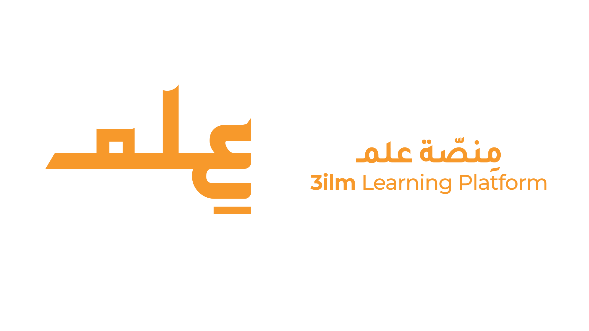

## About 3ilm Platform

3ilm is a robust e-learning platform designed to provide high-quality online education. The project includes features such as a payment gateway for secure transactions and integration with BigBlueButton for seamless virtual meetings and classes, similar to Zoom.

